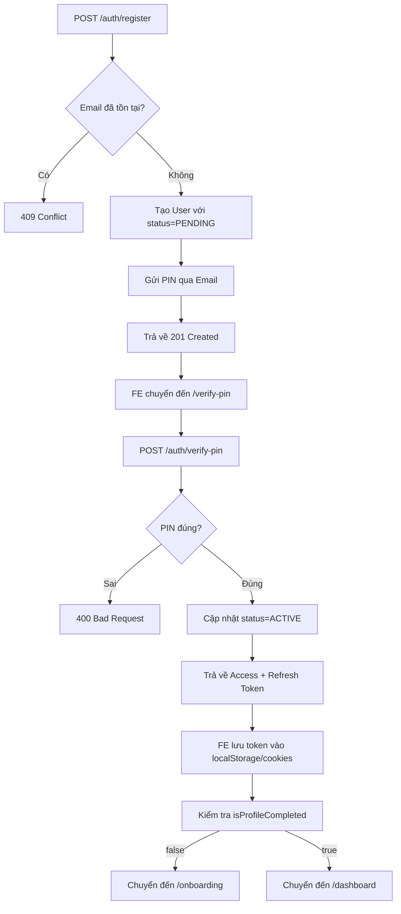
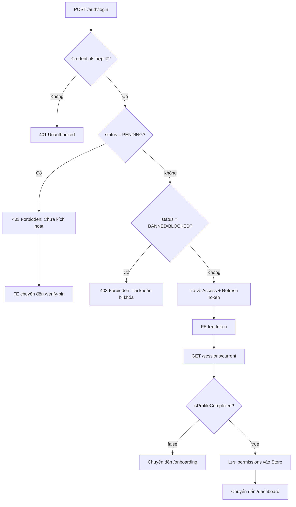

# 🚀 HƯỚNG DẪN TÍCH HỢP FRONTEND - ERG WORKSPACE BACKEND

> **Phiên bản**: 1.0  
> **Ngày cập nhật**: 22/01/2026  
> **Backend URL**: `http://localhost:3000`

---

## 📋 MỤC LỤC

1. [Tổng quan Hệ thống](#1-tổng-quan-hệ-thống)
2. [Luồng Xác thực & Phân quyền](#2-luồng-xác-thực--phân-quyền)
3. [Luồng Onboarding](#3-luồng-onboarding)
4. [Danh sách API Endpoints](#4-danh-sách-api-endpoints)
5. [Cấu trúc Response & Error Handling](#5-cấu-trúc-response--error-handling)
6. [Quản lý Permissions trên Frontend](#6-quản-lý-permissions-trên-frontend)
7. [Tài khoản Test](#7-tài-khoản-test)
8. [Best Practices](#8-best-practices)

---

## 1. TỔNG QUAN HỆ THỐNG

### 1.1. Công nghệ Backend
- **Framework**: NestJS (Node.js)
- **Database**: MySQL (User data) + MongoDB (Logs)
- **Cache**: Redis
- **Authentication**: JWT (Access Token + Refresh Token)
- **Authorization**: RBAC (Role-Based Access Control)

### 1.2. Kiến trúc Phân quyền
```
User → Roles → Permissions
  ↓      ↓         ↓
 1:N    N:N       N:N
```

**Ví dụ**:
- User `admin@erg.edu.vn` có Role `admin`
- Role `admin` có 17 Permissions (full access)
- FE kiểm tra: `user.permissions.includes('posts.create')` → Hiện nút "Tạo bài viết"

---

## 2. LUỒNG XÁC THỰC & PHÂN QUYỀN

### 2.1. Trạng thái User (`status`)

| Status | Mô tả | Hành động FE |
|--------|-------|--------------|
| `PENDING` | Chưa kích hoạt (chưa nhập PIN) | Chuyển đến `/verify-pin` |
| `ACTIVE` | Hoạt động bình thường | Cho phép truy cập |
| `BANNED` | Bị cấm | Hiển thị thông báo + Logout |
| `BLOCKED` | Bị khóa tạm thời | Hiển thị thông báo + Logout |

### 2.2. Luồng Đăng ký & Kích hoạt



### 2.3. Luồng Đăng nhập



### 2.4. Session Context API

**Endpoint**: `GET /sessions/current`  
**Headers**: `Authorization: Bearer <access_token>`

**Response**:
```json
{
  "statusCode": 200,
  "message": "Get current session successfully",
  "data": {
    "user": {
      "id": "uuid",
      "email": "admin@erg.edu.vn",
      "fullName": "Super Administrator",
      "avatarUrl": "https://media.erg.edu.vn/...",
      "status": "ACTIVE"
    },
    "accessControl": {
      "roles": ["admin"],
      "permissions": [
        "users.read",
        "users.create",
        "users.update",
        "users.delete",
        "posts.create",
        "posts.update",
        "posts.delete",
        "roles.read",
        "roles.create",
        "roles.update",
        "roles.assign",
        "system.settings",
        "system.logs"
      ]
    },
    "session": {
      "id": "session-uuid",
      "ipAddress": "127.0.0.1",
      "lastActiveAt": "2026-01-22T09:00:00.000Z",
      "expiresAt": "2026-01-29T09:00:00.000Z"
    },
    "system": {
      "serverTime": "2026-01-22T09:00:00.000Z",
      "version": "1.0.0"
    }
  }
}
```

**Yêu cầu FE**:
1. Gọi API này ngay sau khi App khởi tạo (hoặc sau login).
2. Lưu `accessControl.permissions` vào Global State (Redux/Zustand).
3. Nếu API trả về `403`, nghĩa là user bị khóa → Logout ngay lập tức.

---

## 3. LUỒNG ONBOARDING

### 3.1. Kiểm tra Onboarding

Sau khi login thành công, kiểm tra `user.isProfileCompleted`:
- `false` → Bắt buộc hoàn thiện hồ sơ trước khi vào Dashboard
- `true` → Cho phép truy cập bình thường

### 3.2. API Onboarding

**Endpoint**: `POST /users/onboarding`  
**Headers**: 
- `Authorization: Bearer <access_token>`
- `Content-Type: multipart/form-data`

**Body (FormData)**:
```javascript
const formData = new FormData();
formData.append('fullName', 'Nguyễn Văn A');
formData.append('phone', '0987654321');
formData.append('bio', 'Tôi là một giáo viên...'); // Max 500 ký tự
formData.append('avatar', fileObject); // Optional
```

**Response**:
```json
{
  "statusCode": 200,
  "message": "Update profile successfully",
  "data": {
    "id": "uuid",
    "email": "user@example.com",
    "fullName": "Nguyễn Văn A",
    "phone": "0987654321",
    "bio": "Tôi là một giáo viên...",
    "avatarUrl": "https://media.erg.edu.vn/avatars/...",
    "isProfileCompleted": true
  }
}
```

---

## 4. DANH SÁCH API ENDPOINTS

### 4.1. Authentication (`/auth`)

| Method | Endpoint | Auth | Description |
|--------|----------|------|-------------|
| POST | `/auth/register` | ❌ | Đăng ký tài khoản mới |
| POST | `/auth/login` | ❌ | Đăng nhập |
| POST | `/auth/verify-pin` | ❌ | Xác minh mã PIN |
| POST | `/auth/resend-pin` | ❌ | Gửi lại mã PIN |
| POST | `/auth/logout` | ✅ | Đăng xuất |
| POST | `/auth/refresh` | 🔄 | Làm mới Access Token |
| POST | `/auth/forgot-password` | ❌ | Quên mật khẩu |
| POST | `/auth/reset-password` | ❌ | Đặt lại mật khẩu |

### 4.2. User Profile (`/users`)

| Method | Endpoint | Auth | Permission | Description |
|--------|----------|------|------------|-------------|
| GET | `/users/me` | ✅ | - | Xem hồ sơ cá nhân |
| PATCH | `/users/me` | ✅ | - | Cập nhật hồ sơ |
| POST | `/users/onboarding` | ✅ | - | Hoàn thiện hồ sơ lần đầu |
| PUT | `/users/me/password` | ✅ | - | Đổi mật khẩu |
| GET | `/users/me/sessions` | ✅ | - | Danh sách phiên đăng nhập |
| DELETE | `/users/me/sessions/:id` | ✅ | - | Thu hồi phiên đăng nhập |
| GET | `/users` | ✅ | `users.read` | Danh sách user (Admin) |

### 4.3. Posts (`/posts`)

| Method | Endpoint | Auth | Permission | Description |
|--------|----------|------|------------|-------------|
| GET | `/posts` | ❌ | - | Danh sách bài viết (Public) |
| GET | `/posts/:id` | ❌ | - | Chi tiết bài viết |
| GET | `/posts/slug/:slug` | ❌ | - | Bài viết theo slug |
| POST | `/posts` | ✅ | `posts.create` | Tạo bài viết mới |
| PUT | `/posts/:id` | ✅ | `posts.update` | Cập nhật bài viết |
| DELETE | `/posts/:id` | ✅ | `posts.delete` | Xóa bài viết |

### 4.4. AI Content (`/ai-content`)

| Method | Endpoint | Auth | Permission | Description |
|--------|----------|------|------------|-------------|
| POST | `/ai-content/generate` | ✅ | `posts.create` | Tạo bài viết bằng AI |
| GET | `/ai-content/status/:jobId` | ✅ | - | Kiểm tra trạng thái job |

### 4.5. Access Control (`/access-control`) - Admin Only

| Method | Endpoint | Auth | Permission | Description |
|--------|----------|------|------------|-------------|
| GET | `/access-control/permissions` | ✅ | `roles.read` | Danh sách permissions |
| GET | `/access-control/roles` | ✅ | `roles.read` | Danh sách roles |
| POST | `/access-control/roles` | ✅ | `roles.create` | Tạo role mới |
| PUT | `/access-control/roles/:id` | ✅ | `roles.update` | Cập nhật role |
| PATCH | `/access-control/users/:userId/roles` | ✅ | `roles.assign` | Gán role cho user |

### 4.6. Sessions (`/sessions`)

| Method | Endpoint | Auth | Permission | Description |
|--------|----------|------|------------|-------------|
| GET | `/sessions/current` | ✅ | - | Lấy session context (bao gồm permissions) |

---

## 5. CẤU TRÚC RESPONSE & ERROR HANDLING

### 5.1. Success Response

```json
{
  "statusCode": 200,
  "message": "Operation successful",
  "data": { ... }
}
```

### 5.2. Error Response

```json
{
  "statusCode": 400,
  "message": "Validation failed",
  "error": "Bad Request",
  "timestamp": "2026-01-22T09:00:00.000Z",
  "path": "/api/endpoint"
}
```

### 5.3. Common Error Codes

| Code | Meaning | FE Action |
|------|---------|-----------|
| 400 | Bad Request | Hiển thị lỗi validation |
| 401 | Unauthorized | Gọi `/auth/refresh`, nếu fail → Logout |
| 403 | Forbidden | Hiển thị "Không có quyền" hoặc Logout (nếu bị khóa) |
| 404 | Not Found | Hiển thị "Không tìm thấy" |
| 409 | Conflict | Hiển thị "Dữ liệu đã tồn tại" |
| 500 | Server Error | Hiển thị "Lỗi hệ thống" |

### 5.4. Interceptor Pattern (Axios Example)

```javascript
// Request Interceptor
axios.interceptors.request.use(
  (config) => {
    const token = localStorage.getItem('access_token');
    if (token) {
      config.headers.Authorization = `Bearer ${token}`;
    }
    return config;
  },
  (error) => Promise.reject(error)
);

// Response Interceptor
axios.interceptors.response.use(
  (response) => response.data, // Unwrap data
  async (error) => {
    const originalRequest = error.config;
    
    // Handle 401: Try refresh token once
    if (error.response?.status === 401 && !originalRequest._retry) {
      originalRequest._retry = true;
      
      try {
        const refreshToken = localStorage.getItem('refresh_token');
        const { data } = await axios.post('/auth/refresh', { refreshToken });
        
        localStorage.setItem('access_token', data.accessToken);
        originalRequest.headers.Authorization = `Bearer ${data.accessToken}`;
        
        return axios(originalRequest);
      } catch (refreshError) {
        // Refresh failed → Logout
        localStorage.clear();
        window.location.href = '/login';
        return Promise.reject(refreshError);
      }
    }
    
    // Handle 403: Check if account is banned
    if (error.response?.status === 403) {
      const message = error.response.data.message;
      if (message.includes('banned') || message.includes('blocked')) {
        alert('Tài khoản của bạn đã bị khóa');
        localStorage.clear();
        window.location.href = '/login';
      }
    }
    
    return Promise.reject(error);
  }
);
```

---

## 6. QUẢN LÝ PERMISSIONS TRÊN FRONTEND

### 6.1. Lưu Permissions vào Store

**Zustand Example**:
```javascript
import create from 'zustand';

const useAuthStore = create((set) => ({
  user: null,
  permissions: [],
  roles: [],
  
  setAuth: (user, permissions, roles) => set({ user, permissions, roles }),
  clearAuth: () => set({ user: null, permissions: [], roles: [] }),
  
  hasPermission: (permission) => {
    const { permissions } = useAuthStore.getState();
    return permissions.includes(permission);
  },
}));

export default useAuthStore;
```

**Redux Toolkit Example**:
```javascript
import { createSlice } from '@reduxjs/toolkit';

const authSlice = createSlice({
  name: 'auth',
  initialState: {
    user: null,
    permissions: [],
    roles: [],
  },
  reducers: {
    setAuth: (state, action) => {
      state.user = action.payload.user;
      state.permissions = action.payload.permissions;
      state.roles = action.payload.roles;
    },
    clearAuth: (state) => {
      state.user = null;
      state.permissions = [];
      state.roles = [];
    },
  },
});

export const { setAuth, clearAuth } = authSlice.actions;
export default authSlice.reducer;

// Selector
export const selectHasPermission = (permission) => (state) =>
  state.auth.permissions.includes(permission);
```

### 6.2. Custom Hook

```javascript
import { useAuthStore } from '@/store/auth';

export const usePermission = (permission) => {
  const permissions = useAuthStore((state) => state.permissions);
  return permissions.includes(permission);
};

// Usage
const canCreatePost = usePermission('posts.create');
```

### 6.3. Component Wrapper

```jsx
import { useAuthStore } from '@/store/auth';

export const Can = ({ permission, children, fallback = null }) => {
  const hasPermission = useAuthStore((state) => 
    state.permissions.includes(permission)
  );
  
  return hasPermission ? children : fallback;
};

// Usage
<Can permission="posts.create">
  <button onClick={handleCreate}>Tạo bài viết</button>
</Can>

<Can permission="users.delete" fallback={<span>Không có quyền</span>}>
  <button onClick={handleDelete}>Xóa</button>
</Can>
```

### 6.4. Route Protection

```jsx
import { Navigate } from 'react-router-dom';
import { useAuthStore } from '@/store/auth';

export const ProtectedRoute = ({ permission, children }) => {
  const hasPermission = useAuthStore((state) => 
    state.permissions.includes(permission)
  );
  
  if (!hasPermission) {
    return <Navigate to="/403" replace />;
  }
  
  return children;
};

// Usage in Router
<Route 
  path="/admin/users" 
  element={
    <ProtectedRoute permission="users.read">
      <UsersPage />
    </ProtectedRoute>
  } 
/>
```

---

## 7. TÀI KHOẢN TEST

### 7.1. Admin Account
```
Email: admin@erg.edu.vn
Password: Admin@2025
Roles: admin
Permissions: Full access (17 permissions)
```

### 7.2. Test User (Tự tạo)
```
1. POST /auth/register với email bất kỳ
2. Kiểm tra email để lấy PIN
3. POST /auth/verify-pin
4. User mới sẽ có role "user" với permission "posts.read"
```

---

## 8. BEST PRACTICES

### 8.1. Security
- ✅ **Không lưu password** trong state/localStorage
- ✅ **Lưu token** trong `httpOnly cookies` (nếu có thể) hoặc `localStorage`
- ✅ **Xóa token** ngay khi logout hoặc gặp 403 (banned)
- ✅ **Validate permissions** ở cả FE và BE (FE chỉ để UX, BE mới là source of truth)

### 8.2. Performance
- ✅ **Cache permissions** trong memory, không gọi `/sessions/current` mỗi lần render
- ✅ **Debounce** các API search/filter
- ✅ **Pagination** cho danh sách dài

### 8.3. UX
- ✅ **Loading states** cho mọi API call
- ✅ **Toast notifications** cho success/error
- ✅ **Optimistic updates** khi có thể (ví dụ: like/unlike)
- ✅ **Skeleton screens** thay vì spinner

### 8.4. Error Messages
```javascript
const ERROR_MESSAGES = {
  'Account is not activated': 'Tài khoản chưa được kích hoạt. Vui lòng kiểm tra email.',
  'Account has been banned': 'Tài khoản của bạn đã bị khóa. Liên hệ Admin.',
  'Invalid credentials': 'Email hoặc mật khẩu không đúng.',
  'Email already exists': 'Email này đã được đăng ký.',
};

const getErrorMessage = (error) => {
  const message = error.response?.data?.message || 'Có lỗi xảy ra';
  return ERROR_MESSAGES[message] || message;
};
```

---

## 9. POSTMAN COLLECTION

File `erg_postman_collection.json` đã được cung cấp tại thư mục gốc của Backend.

**Cách sử dụng**:
1. Mở Postman → Import → Chọn file `erg_postman_collection.json`
2. Thiết lập biến môi trường:
   - `base_url`: `http://localhost:3000`
   - `access_token`: (Sẽ tự động điền sau khi login)
   - `refresh_token`: (Sẽ tự động điền sau khi login)

---

## 10. CHECKLIST TÍCH HỢP

### Phase 1: Authentication
- [ ] Trang Login
- [ ] Trang Register
- [ ] Trang Verify PIN
- [ ] Trang Forgot Password
- [ ] Trang Reset Password
- [ ] Interceptor xử lý 401/403
- [ ] Auto refresh token

### Phase 2: Onboarding
- [ ] Kiểm tra `isProfileCompleted` sau login
- [ ] Trang Onboarding (Form + Upload avatar)
- [ ] Redirect logic

### Phase 3: Permissions
- [ ] Lưu permissions vào Store
- [ ] Hook `usePermission()`
- [ ] Component `<Can permission="...">`
- [ ] Protected Routes

### Phase 4: Core Features
- [ ] Dashboard (Hiển thị theo permissions)
- [ ] User Profile
- [ ] Posts Management (CRUD với permission check)
- [ ] AI Content Generation (nếu có quyền)

### Phase 5: Admin Panel
- [ ] User Management (GET /users)
- [ ] Role Management (CRUD roles)
- [ ] Assign Roles to Users

### Phase 6: Analytics
- [ ] Tích hợp Track Visit (usePageTracking hook)
- [ ] Tích hợp Track Event (custom events)
- [ ] Admin Dashboard (nếu có quyền system.logs)

---

## 11. TÍCH HỢP ANALYTICS

### 11.1. Tổng quan
Hệ thống Analytics cho phép theo dõi hành vi người dùng tương tự Google Analytics nhưng **hoàn toàn tự xây dựng**, không phụ thuộc bên thứ 3.

### 11.2. API Endpoints

| Method | Endpoint | Auth | Mô tả |
|--------|----------|------|-------|
| POST | `/analytics/visits/start` | Optional | FE gọi khi user vào trang mới |
| POST | `/analytics/events` | Optional | Track các sự kiện (click, submit...) |
| PUT | `/analytics/visits/:id/end` | No | Cập nhật thời gian ở lại khi user rời đi |
| GET | `/analytics/dashboard` | ✅ `system.logs` | API Dashboard cho Admin |

### 11.3. Triển khai Tracking trên Frontend

**Hook `usePageTracking` (React Example):**
```typescript
import { useEffect, useRef } from 'react';
import { useLocation } from 'react-router-dom';
import { api } from '@/lib/api';

export const usePageTracking = () => {
  const location = useLocation();
  const visitIdRef = useRef<string | null>(null);
  const startTimeRef = useRef<number>(Date.now());

  useEffect(() => {
    // 1. Track khi vào trang
    const trackVisit = async () => {
      startTimeRef.current = Date.now();
      
      try {
        const response = await api.post('/analytics/visits/start', {
          url: window.location.href,
          referrer: document.referrer,
        });
        visitIdRef.current = response.data.visitId;
      } catch (error) {
        console.warn('Failed to track visit:', error);
      }
    };

    trackVisit();

    // 2. Track khi rời trang
    const handleUnload = () => {
      if (visitIdRef.current) {
        const durationSeconds = Math.round((Date.now() - startTimeRef.current) / 1000);
        
        // Dùng sendBeacon để đảm bảo request được gửi khi đóng tab
        navigator.sendBeacon(
          `/api/analytics/visits/${visitIdRef.current}/end`,
          JSON.stringify({ duration: durationSeconds })
        );
      }
    };

    window.addEventListener('beforeunload', handleUnload);
    
    return () => {
      handleUnload(); // Cleanup khi route change
      window.removeEventListener('beforeunload', handleUnload);
    };
  }, [location.pathname]);
};

// Sử dụng trong App.tsx hoặc Layout component
function App() {
  usePageTracking();
  return <Router>...</Router>;
}
```

**Tracking Custom Events:**
```typescript
export const trackEvent = async (
  eventType: string, 
  metadata: Record<string, any>
) => {
  try {
    await api.post('/analytics/events', {
      eventType,
      metadata,
      sessionInternalId: getSessionId(), // UUID lưu trong localStorage
    });
  } catch (error) {
    console.warn('Failed to track event:', error);
  }
};

// Sử dụng
trackEvent('course_enrolled', { 
  courseId: 'ielts-7-0', 
  price: 1500000 
});
```

### 11.4. Dashboard API Response

**GET `/analytics/dashboard?from=2026-01-15&to=2026-01-22`**

```json
{
  "dateRange": {
    "current": { "from": "2026-01-15T00:00:00.000Z", "to": "2026-01-22T23:59:59.999Z" },
    "previous": { "from": "2026-01-08T00:00:00.000Z", "to": "2026-01-14T23:59:59.999Z" }
  },
  "summary": {
    "totalVisits": { "value": 5000, "previous": 4500, "growth": 11.1 },
    "activeUsers": { "value": 1250, "previous": 1100, "growth": 13.6 },
    "newUsers": { "value": 150, "previous": 180, "growth": -16.7 },
    "avgDuration": { "value": 180, "previous": 150, "growth": 20.0 },
    "bounceRate": { "value": 35, "previous": 40, "growth": -12.5 }
  },
  "trafficChart": [
    { "label": "2026-01-15", "mobile": 100, "desktop": 200, "total": 300 },
    { "label": "2026-01-16", "mobile": 120, "desktop": 180, "total": 300 }
  ],
  "locations": [
    { "city": "Ho Chi Minh City", "country": "VN", "count": 2500 },
    { "city": "Hanoi", "country": "VN", "count": 1200 }
  ],
  "devices": {
    "types": [
      { "name": "mobile", "count": 2000, "percentage": 40 },
      { "name": "desktop", "count": 3000, "percentage": 60 }
    ],
    "os": [
      { "name": "Android", "count": 1500, "percentage": 30 }
    ],
    "browsers": [
      { "name": "Chrome", "count": 3500, "percentage": 70 }
    ]
  },
  "content": {
    "topCourses": [{ "url": "/courses/ielts", "title": "ielts", "views": 500 }],
    "topPosts": [{ "url": "/posts/bi-quyet", "title": "bi-quyet", "views": 300 }],
    "topPages": [{ "url": "/", "title": "/", "views": 2000 }]
  },
  "peakHours": [
    { "hour": 20, "count": 800 },
    { "hour": 21, "count": 750 }
  ],
  "trafficSources": [
    { "source": "Direct", "count": 2000, "percentage": 40 },
    { "source": "Google", "count": 1500, "percentage": 30 },
    { "source": "Facebook", "count": 1000, "percentage": 20 }
  ]
}
```

### 11.5. Lưu ý quan trọng
- ✅ API `/visits/start` là **Public** nhưng nếu gửi kèm Token sẽ track được userId.
- ✅ Dùng `navigator.sendBeacon` cho `beforeunload` để đảm bảo request không bị cancel.
- ✅ Dashboard API yêu cầu quyền `system.logs` (chỉ Admin).
- ✅ Growth Rate được tính tự động = `(current - previous) / previous * 100`.

---

## 12. HỖ TRỢ & LIÊN HỆ

- **Backend Repository**: [Link to repo]
- **API Documentation**: `http://localhost:3000/api-docs` (Nếu có Swagger)
- **Backend Developer**: [Contact info]

---

**Chúc các bạn Frontend tích hợp thành công! 🎉**

